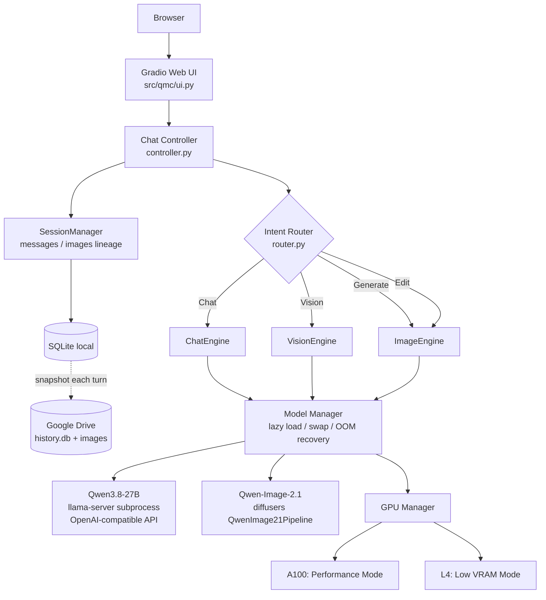

# 技術ガイド

利用手順と現在の画面操作は [README](README.md) にまとめています。このページにはモデル構成、実機測定、設定値、設計上の制限などの詳細を残しています。

Google Colab の GPU をバックエンドにして、ブラウザから ChatGPT / Qwen Web 版のように使える**自分専用のマルチモーダル Qwen Web Chat**です。
1つのチャット画面で、テキストチャット・画像の理解・画像生成・画像編集・会話の継続・履歴の保存と復元ができます。

> **English summary** — A personal multimodal chat UI (Gradio) for Google Colab. Qwen3.8-27B (llama.cpp GGUF + mmproj) handles text, vision, PDFs, tall screenshots and short videos. Qwen-Image-2.1 handles generation, variation selection and editing with multiple references or a coarse mask; an optional remote Image HTTP backend can replace local Diffusers. The UI includes an image strip, CPU speech recognition and optional network text-to-speech. Conversation context is bounded without deleting saved history. **The original chat, vision and image flows were verified on Colab A100 80GB. The new features have CPU tests but have not yet been verified on Colab GPU** (see [Limitations](#15-limitations)).


---

## 1. このプロジェクトとは

- **Chat**: Qwen3.8-27B と日本語で会話（Thinking の ON/OFF 切替可、思考過程は折りたたみ表示）
- **Vision**: 画像をアップロードして質問。生成画像・編集画像についても質問できる
- **PDF / 縦長Vision**: PDFをページごとに読み込み、縦長スクリーンショットを重なりのある帯に分割して読む
- **短尺動画**: 30秒・80MB以内の動画から最大8フレームを選び、時系列を説明する
- **Web検索**: 既定では毎ターンWeb検索し、出典付きで回答（学習データの期限を補う）
- **Image Generation**: 「〜を描いて」「〜を生成して」で Qwen-Image-2.1 が画像生成
- **バリエーション**: 1回の生成指示から異なるseedで最大4枚を順番に作成
- **バリエーション選択 / マスク**: var1〜var4から編集対象を選択。塗った領域を参照する編集もできる
- **Image Editing**: 画像を添付して「背景を東京の夜景に変更して」、生成直後に「もう少し明るく」などの追加指示
- **複数参照 / 系譜**: 顔・服装・構図の参照画像を複数添付。サイドバーの画像系譜から版を選び、1個前・2個前への移動や元画像への復元ができる
- **音声入力**: マイクまたは音声ファイルを文字起こしし、チャット本文とともに保存
- **読み上げ**: 回答文をネットワーク音声で再生（既定オフ）
- **Remote Image**: `QMC_IMAGE_BASE_URL` を設定すると画像生成・編集を外部 HTTP ワーカーへ送る
- **比較**: 「元画像と今の画像の違いを説明して」→ 元画像と最新画像を両方 Vision に渡して説明
- **履歴**: SQLite + Google Drive。Colab を再起動しても過去チャットと画像が復元される
- **自動ルーティング**: モデルを意識せずに使える Auto モード＋手動切替（Chat / Vision / Generate / Edit）

画面は会話欄と添付操作を中心にし、モード・検索設定・画像設定・マスク・システム状態は必要なときだけ開けます。配色はチャコールとフューシャです。会話が長くなっても保存済み履歴は消さず、モデルへ送る直近の文脈だけを制限します。

## 2. Architecture



| 層 | ファイル | 役割 |
| --- | --- | --- |
| UI | `ui.py` | Gradio。ロジックは持たず Controller のイベントを描画するだけ |
| Controller | `controller.py` | 1ターン = ルーティング → エンジン実行 → 履歴保存。UI非依存のイベントストリーム |
| Router | `router.py` | ルールベースの意図判定（日本語/英語）＋手動モード |
| Engines | `chat_engine.py`, `vision_engine.py`, `image_engine.py` | 文脈組み立て・生成パラメータ |
| Model Manager | `model_manager.py` | 遅延ロード、同時常駐可否に応じたアンロード、OOM時の回復 |
| GPU Manager | `gpu_manager.py` | GPU判定・プロファイル選択・VRAM計測 |
| Backends | `backends/llama_server.py`, `backends/qwen_image.py`, `backends/mock.py` | モデル実体。差し替え可能 |
| History | `history_manager.py`, `session_manager.py` | SQLite（ローカル）＋ Drive ミラー、画像のリビジョン系譜 |

設計判断は ADR にまとめています: [ADR-0001 2モデル構成](docs/adr/0001-two-model-architecture.md) / [ADR-0002 SQLite + Drive](docs/adr/0002-sqlite-local-copy-with-drive-mirror.md) / [ADR-0003 仕様からの変更点](docs/adr/0003-implementation-choices.md) / [ADR-0007 画像系譜・PDF・音声](docs/adr/0007-lineage-pdf-asr.md) / [ADR-0008 次段階の入力と UI](docs/adr/0008-mask-video-tts-image-http.md)。外部画像ワーカーの形式は [Image HTTP API](docs/image-http-api.md) を参照してください。

## 3. Supported Models

調査の詳細（既存Notebook・HF・公式GitHub・ソースコードの確認結果）は [docs/phase0-research.md](docs/phase0-research.md)。

| 用途 | モデル | 実行方法 | 量子化 | ライセンス |
| --- | --- | --- | --- | --- |
| Text / Vision / Reasoning | [`huihui-ai/Huihui-Qwen3.8-27B-abliterated-GGUF`](https://huggingface.co/huihui-ai/Huihui-Qwen3.8-27B-abliterated-GGUF) `Huihui-Qwen3.8-27B-abliterated-UD-DW-Q8_K_L.gguf` + [公式 mmproj](https://huggingface.co/ggml-org/Qwen3.8-27B-GGUF) `mmproj-Qwen3.8-27B-Q8_0.gguf` | llama.cpp `llama-server`（commit `4da6337` を固定ビルド） | GGUF Q8_K_L（旧: Q4_K_M） | Apache-2.0 |
| Image Generation / Editing | [`Qwen/Qwen-Image-2.1`](https://huggingface.co/Qwen/Qwen-Image-2.1) | diffusers `QwenImage21Pipeline`（main `e0abab8` 固定） | A100: bf16 / L4: DiT int8 (torchao) | Qwen Research License（非商用研究用途） |

**推奨構成**: メインの GPU は **A100 80GB**、Chat は **Qwen3.8-27B Q8_K_L**（Q4_K_M から変更）です。L4 / A100 40GB 向けのプロファイルもそのまま残していますが、Q8_K_L での動作は A100 80GB 以外では未確認です。Q8_K_L での VRAM は **未計測**（過去の実測は Q4_K_M 時の値。[`docs/vram-measurements.md`](docs/vram-measurements.md) 参照）。

**なぜ2モデル？** Qwen3.8-27B は画像・動画入力に対応したネイティブVLMです。Chat GGUF と公式 `mmproj` は別リポジトリから取得します。Vision 専用モデルを常駐させる必要がないため、VRAMを節約できる2モデル構成にしました。
`11_qwen3_vl_image_judge.ipynb` は Google Drive 上で見つからず、内容を比較できていません（見つかれば `ChatBackend` を追加して3モデル構成にも拡張できます）。

## 4. A100 / L4 の違い

起動時に GPU を自動判定してプロファイルを選びます（`--profile` / `PROFILE` で上書き可）。

| | A100 80GB (`a100_80`) | A100 40GB (`a100_40`) | L4 24GB (`l4`) |
| --- | --- | --- | --- |
| 表示モード | Performance | Performance | Low VRAM |
| Chat と Image の同時常駐 | ✅ する | ❌ 入れ替え | ❌ 入れ替え |
| Qwen-Image DiT 精度 | bf16 | bf16 | int8 (torchao weight-only) |
| Qwen-Image 配置 | 全部GPU | `enable_model_cpu_offload()` | `enable_model_cpu_offload()` |
| 画像パイプラインのRAM保持 | ✅ | ✅（再有効化が速い） | ✅ |
| Chat コンテキスト長 | 32k | 32k | 16k |
| 既定ステップ数 / 最大解像度帯 | 40 / 2048 | 40 / 2048 | 28 / 1280 |
| VAE タイリング | なし | なし | 2048帯以上 |

判断根拠（計測前の設計値。Q4_K_M 時代の見積もりで、Q8_K_L への変更後は未再計測）: 27B Q4_K_M ≈ 17GB + KV（Q8_K_L の GGUF は約 27GB で、その分 VRAM 使用量は増える。実測値は未計測）、Qwen-Image のテキストエンコーダ（Qwen3-VL 8B, bf16）≈ 16–17GB、DiT 7B（bf16 ≈ 14GB / int8 ≈ 7GB）。
そのため 40GB 以下では同時常駐させず、`ModelManager` が必要なときだけ切り替えます（同じモデルの無駄な再ロードはしません）。
**L4 では Chat ↔ Image の切り替えごとに数十秒〜1分程度の待ち**が発生します。

> H100 など他のGPUは VRAM 量で判定します（≥70GiB → `a100_80`、≥38GiB → `a100_40`、それ以外 → `l4`）。

## 5. Quick Start

### Colab（本番）

1. `Qwen-Multimodal-Colab.ipynb` を Colab で開く（GitHub から開く or Drive にコピー）
2. ［ランタイム］→［ランタイムのタイプを変更］→ **A100**（推奨）/ **L4**
3. 🔑 Secrets に `HF_TOKEN`（推奨）を登録し、Notebook からのアクセスを許可
4. 4つのセルを上から実行 → 表示されたリンクを開く

### ローカル（開発・UI確認 / GPU不要）

```bash
pip install -r requirements-dev.txt
PYTHONPATH=src python -m qmc --mock        # http://localhost:7860
PYTHONPATH=src python -m pytest            # CPU テスト
```

## 6. Colab 起動方法

Notebook は4セルだけで、ロジックはすべて `src/qmc/` にあります。

| セル | 内容 |
| --- | --- |
| 1 | リポジトリを clone（2回目以降は pull） |
| 2 | `requirements-colab.txt` をインストール（**torch は入れ直さない**）、Drive マウント、`llama-server` を用意（初回は検出したGPUのCUDA archだけビルド。A100で約20〜30分 → Drive にキャッシュ、次回以降は数秒） |
| 3 | 設定（`SHARE` / `PREFETCH` / `PROFILE`） |
| 4 | `colab.launch()` で Gradio を起動し、Colab のプロキシURLを表示 |

コマンドで起動する場合:

```bash
python -m qmc                 # 自動判定
python -m qmc --profile l4    # プロファイル指定
python -m qmc --share         # 公開URL（Security 参照）
```

主な環境変数（Colab Secrets からも読み込みます）:

| 変数 | 説明 |
| --- | --- |
| `HF_TOKEN` | Hugging Face トークン（推奨） |
| `QMC_DATA_DIR` | 履歴・画像の保存先（既定: Drive の `MyDrive/qwen-multimodal-colab/data`） |
| `QMC_GPU_PROFILE` | `a100_80` / `a100_40` / `l4` |
| `QMC_AUTH_USER` / `QMC_AUTH_PASSWORD` | Gradio のログイン（`share=True` 時は必須推奨） |
| `QMC_CHAT_BASE_URL` / `QMC_CHAT_API_KEY` | 外部の OpenAI 互換サーバー（vLLM on RunPod 等）を Chat に使う |
| `QMC_IMAGE_BASE_URL` / `QMC_IMAGE_API_KEY` | 外部の画像ワーカーを使う。指定時はローカル Diffusers をロードしない |
| `QMC_PROMPT_REWRITE` | `auto` / `on` / `off` |
| `TAVILY_API_KEY` / `BRAVE_API_KEY` | Web検索プロバイダのAPIキー（任意。無ければ DuckDuckGo） |
| `QMC_WEB_SEARCH` | `on`（既定。`auto` / `off` に変更可） |
| `QMC_CONTENT_POLICY` | `open`（既定）/ `standard`。画面から各ターンで切替可能 |
| `QMC_SEARCH_SAFESEARCH` | `auto`（open は off、standard は moderate）/ `off` / `moderate` / `strict` |
| `QMC_SEARCH_PROVIDER` | `auto` / `tavily` / `brave` / `duckduckgo` |
| `QMC_SEARCH_REGION` | DuckDuckGo の地域。既定 `jp-jp`。0件の場合は `wt-wt` で再試行 |
| `QMC_SEARCH_MAX_RESULTS` | 統合後の検索結果上限。既定 `8` |
| `QMC_SEARCH_FETCH_PAGES` | 本文を取得する上位ページ数。既定 `5` |
| `QMC_SEARCH_PAGE_CHARS` | 1ページの本文文字数上限。既定 `4000` |
| `QMC_PDF_MAX_PAGES` | PDFの読み込みページ数。既定 `6` |
| `QMC_VIDEO_MAX_SECONDS` / `QMC_VIDEO_MAX_MB` | 動画入力の上限。既定 `30` 秒 / `80` MB |
| `QMC_ASR_DEVICE` | 音声認識の実行先。既定 `cpu`、`cuda` も指定可 |
| `QMC_ASR_MODEL` | faster-whisper のモデル。既定 `small` |
| `QMC_TTS` | `on` / `off`。読み上げの既定値（既定 `off`） |
| `QMC_TTS_VOICE` | edge-tts の声。既定 `ja-JP-NanamiNeural` |
| `QMC_CHAT_HF_REPO` | `huihui-ai/Huihui-Qwen3.8-27B-abliterated-GGUF` |
| `QMC_CHAT_MODEL_FILE` | `Huihui-Qwen3.8-27B-abliterated-UD-DW-Q8_K_L.gguf` |
| `QMC_CHAT_MMPROJ_REPO` | `ggml-org/Qwen3.8-27B-GGUF` |
| `QMC_CHAT_MMPROJ_FILE` | `mmproj-Qwen3.8-27B-Q8_0.gguf` |
| `QMC_CHAT_REMOTE_MODEL_NAME` | 外部 Chat サーバーに送るモデル名 |
| `QMC_MOCK=1` | CPU モック |

## 7. Google Drive 履歴保存

```
MyDrive/qwen-multimodal-colab/
├── data/
│   ├── history.db                 # SQLite スナップショット（毎ターン更新）
│   └── sessions/<session_id>/images/<image_id>.png
└── llama-bin/<commit>-sm80_89_90/llama-server   # ビルドキャッシュ
```

- テーブル: `sessions`, `messages`, `images`, `generations`, `model_settings`
- 画像は `parent_id` / `root_id` / `revision` で **original → revision 1 → revision 2** の系譜を保持。サイドバーで版を選び「元に戻す」や「2個前を編集」を使えます
- 生成パラメータ（prompt / 最適化後prompt / steps / seed / 解像度 / 参照画像ID / 所要時間）を `generations` に保存
- ライブDBはローカル、Drive にはアトミックにスナップショット（[ADR-0002](docs/adr/0002-sqlite-local-copy-with-drive-mirror.md)）
- Drive 未マウント時は `/content/qmc-data` に保存し、UI に「ランタイム終了で消えます」と警告

## 8. Chat

- Qwen の推奨サンプリング（HF モデルカード）を使用: non-thinking `T=0.7, top_p=0.8, top_k=20, presence_penalty=1.5` / thinking `T=1.0, top_p=0.95, top_k=20`
- 「Thinking」チェックで `chat_template_kwargs.enable_thinking` を切替。思考は `reasoning_content` として分離し、折りたたみ表示
- 文脈は直近 24 メッセージから約14,000文字までを送信。画像は対象画像を優先し、通常チャットでは自動添付を最大1枚に抑える。古い画像は `[画像 #id: ...]` ラベルとして残す（トークン節約）
- ストリーミング表示、Stop / Regenerate / Clear / New Chat / 過去チャット一覧

## 9. Vision

- 画像を添付して質問 → Qwen3.8-27B（mmproj）で回答。テキスト無しで画像だけ送ると説明を返す
- 「この画像の…」「さっきの画像…」→ 直近の生成・編集画像を対象に質問
- 「元画像と今の画像の違い」→ 系譜の root と最新を、「前の画像との違い」→ 親と最新を比較
- アップロード画像は検証（形式・破損・30MB上限）、EXIF 回転補正、長辺 2048px に縮小
- PDFは先頭から最大6ページを画像に変換してVisionに渡します（既定30MB上限）。PDFだけを添付するとページ順の要約を依頼します。`QMC_PDF_MAX_PAGES` で上限を変更できます
- 縦長スクリーンショットは約128px重なる帯に分割してVisionに渡します。履歴と系譜に保存するのは元の1枚だけです
- mp4 / webm / mov / mkv は **30秒・80MB以内**を受け付け、ffmpeg で先頭・末尾を含む最大8フレームを均等に取り出してVisionへ渡します。履歴には先頭の1枚だけを残します。動画生成はありません

## 10. Image Generation

- 「〜を描いて」「〜のイラストを作って」「〜を生成して」→ Qwen-Image-2.1
- 固有キャラの生成・編集では `GENERATE` / `EDIT` のまま外見検索 → 外見カード → プロンプト書き換え → 画像生成と進みます。外見カードには検索結果で確認できた髪・目・顔・体格・衣装・画風だけを載せ、確認できない特徴は補いません。回答末尾に検索元を表示します
- 添付した参照画像は顔・髪・体格の根拠として検索テキストより優先します。2枚以上の参照画像があり検索を明示しなかった場合は外見検索を省きます。検索に失敗した場合は外見未確認を明示します。精度を高めるには公式画像を添付してください
- 左の「ツール」で Web検索を `オフ` にすると外見検索を省き、プロンプト最適化を `オフ` にすると外見カードを画像プロンプトへ使いません。成人向けの場面指定は外見検索クエリに含めず、画像プロンプトには保持します
- 公式推奨アスペクト比（1:1, 4:3, 3:4, 3:2, 2:3, 16:9, 9:16）を解像度帯に合わせて 32 の倍数で縮小
- 画像プロンプト最適化（既定 `auto`）: Chat モデルがロード済みなら、会話文脈を踏まえた英語プロンプトに変換（L4 でわざわざ再ロードはしない）
- 🎨 設定: アスペクト比、解像度帯、Steps、Seed（-1 = ランダム）
- 進捗（step 数）を表示、Stop で中断
- 🎨 設定のバリエーションは既定1枚、4枚も選べます。4枚は1枚ずつ生成し、seedを7919ずつずらして同じアシスタント回答に保存します。Stopすると残りは生成しません。L4で4枚を選ぶと時間がかかります
- 4枚生成後はサイドバーに `var1`〜`var4` が並び、既定では **var1** が選ばれます。サムネイルを選んで「これを編集」、または「3枚目を少し暗く」で指定した画像から編集します
- `QMC_IMAGE_BASE_URL` を指定すると外部画像ワーカーを使用します。形式は [Image HTTP API](docs/image-http-api.md)。同梱の `scripts/image_http_stub.py` は通信確認専用です

## 11. Image Editing

- 画像添付＋「背景を〜に変更して」「〜を消して」→ 編集
- 生成・編集の直後（3ターン以内）の「もう少し明るく」「ネオンを増やして」→ 直前画像を編集
- 編集結果は親画像の revision + 1 として保存
- **編集時は系譜内で使った seed を使わない**（同じ seed・解像度だと指示を無視したほぼコピーになる既知の挙動: [diffusers#14824](https://github.com/huggingface/diffusers/issues/14824)）
- 出力のアスペクト比は元画像に合わせる。参照画像は最大10枚
- 顔・服装・構図の写真を複数添付するとすべてを参照画像として編集に渡します。系譜で画像を選んでいる場合は添付画像の**後ろ**に選択画像を置き、最後の画像が編集結果のアスペクト比を決めます
- サイドバーの系譜ストリップで版を選択できます。「1個前」「2個前を編集」は対象画像を切り替えるだけで、次の編集指示を待ちます。「元に戻す」または「元に戻して」は元画像の画素を新しいrevとしてコピーし、画像モデルを動かしません。「元に戻して明るくして」は元画像を参照した編集です
- 「マスクで編集」を開いて画像に塗り、`マスクを使う` をオンにして指示を送れます。固定版 Qwen-Image-2.1 にはマスク専用の引数がないため、ローカルでは領域を赤く示した画像と白黒マスクを追加参照として渡します。指定領域以外が完全に保たれる保証はありません。HTTP ワーカーには `mask` を送ります

### 音声入力

テキスト欄の下のマイクで録音するか、音声ファイル（wav / mp3 / m4a / webm / ogg）を添付できます。音声だけなら文字起こしをチャット本文にし、テキストもある場合は続けて送信します。既定はCPU上の `faster-whisper` `small`（日本語）で、最初の音声入力時にだけロードします。`--mock` では固定の文字起こし文を使います。

「読み上げ」をオンにすると回答の本文を `edge-tts` で再生します。初期状態はオフで、ネットワーク接続が必要です。失敗しても回答は保存されます。`--mock` では短い WAV を返します。

### 11.5 Web検索（リアルタイム情報）

モデルの学習データには期限があるため、最新情報が必要な質問は Web 検索して出典付きで答えます。

- 画面の **🌐 Web検索**: `常に`（既定。毎ターン検索）/ `自動`（「最新」「今日」などのキーワードで判定）/ `オフ`
- **コンテンツ方針**: `開放` は合法な成人向け・センシティブな話題を検索・回答し、safesearch を既定で off にします。`標準` は safesearch が既定で moderate です。未成年者の性的内容はどちらでも扱いません
- 流れ: Chat モデルが最大3件の検索クエリを作成 → 各クエリを検索してURLの重複を統合（上位8件）→ 上位5ページの本文を取得 → 番号付きの参考データとしてシステムプロンプトに入れて回答 → 末尾に **🔎 参考（Web検索）** のリンク一覧。取得した本文が空なら検索結果の抜粋を使います
- 検索プロバイダ（自動選択）: `開放` でBraveキーとDuckDuckGoが使える場合は **両方を検索**して統合します。それ以外の `開放` は Brave → DuckDuckGo → Tavily、`標準` は Tavily → Brave → DuckDuckGo の優先順です。Tavily の Acceptable Use Policy は性的に露骨なクエリを禁じています。明示的に Tavily を選んだ場合は警告が表示されます
- `開放` のChatで回答が拒否文になった場合は一度だけ再生成します。検索が未実行なら検索してから再生成し、検索済みなら取得結果にある固有名詞とURLを優先するよう指示します。保存する回答は最終結果のみです
- 既定の Chat は拒否方向を削ったコミュニティ GGUF です。品質・指示追従が公式より落ちることがあります。公式に戻す設定は下表を参照してください。Vision 用 mmproj は公式リポジトリから取得します。

| 公式 Chat に戻す環境変数 | 値 |
| --- | --- |
| `QMC_CHAT_HF_REPO` | `ggml-org/Qwen3.8-27B-GGUF` |
| `QMC_CHAT_MODEL_FILE` | `Qwen3.8-27B-Q4_K_M.gguf` |
| `QMC_CHAT_MMPROJ_REPO` | `ggml-org/Qwen3.8-27B-GGUF` |

代替のコミュニティ GGUF は [`mradermacher/Qwen3.8-27B-OBLITERATED-GGUF`](https://huggingface.co/mradermacher/Qwen3.8-27B-OBLITERATED-GGUF) の `Qwen3.8-27B-OBLITERATED.Q4_K_M.gguf` もあります。使う場合は `QMC_CHAT_HF_REPO` と `QMC_CHAT_MODEL_FILE` を変更し、mmproj は引き続き公式を指定してください。モデル変更後はランタイム再起動、または画面の「⏏ モデル解放」のあと Cell 4 を再実行してください。
- 検索しないときも、システムプロンプトに**現在日時（JST）**を入れ、「学習データ以降は知らない」ことをモデルに伝えています
- 検索結果は「データ」として扱い、ページ内の指示には従わないようにプロンプトで明示しています（プロンプトインジェクション対策）
- 画像プロンプトの最適化は既定で `auto`（Chatがロード済みの場合だけ英語化）です。`開放` で元の成人向け語句が書き換えから消えた場合は元のプロンプトを使用します。画面の「そのまま使う」または `QMC_PROMPT_REWRITE=off` でも書き換えを無効にできます。画像モデルのテキストエンコーダはQwen-Image-2.1公式のままです

## 12. GPU / VRAM

- サイドバーに GPU 名、モード（Performance / Low VRAM）、VRAM 使用量（nvidia-smi + torch）、ロード中モデルを 5 秒ごとに表示。「⏏ モデル解放」で全アンロード
- **CUDA OOM 時**: アプリは落ちず、`他モデルのunload → empty_cache → 省VRAM設定に降格 → 1回再試行` を行う
  - Qwen-Image の降格順: 全GPU常駐 → CPU offload → VAE タイリング → DiT int8
  - llama-server: コンテキスト長を半分に、`--fit-target` を増やして再起動
- 計測: `PYTHONPATH=src python -m qmc.bench` で各フェーズ（ロード直後 / テキスト生成 / Vision / 生成 / 編集 / unload後）の `memory_allocated` / `memory_reserved` / `max_memory_allocated` / nvidia-smi を [docs/vram-measurements.md](docs/vram-measurements.md) に追記

| GPU | 状態 |
| --- | --- |
| A100 80GB | ✅ 実機検証・計測済み（ピーク約 61 GiB、生成 1024² 40step 16s / 編集 18s）→ [docs/vram-measurements.md](docs/vram-measurements.md) |
| A100 40GB | 未検証・未計測 |
| L4 | **未検証・未計測** |

### Colab A100 80GB での実機検証（2026-09-28）

| MVP テスト | 結果 | メモ |
| --- | --- | --- |
| 1. 「TerraformとPulumiの違いを教えて」→ Text | ✅ | ストリーミングで日本語回答（Router: Chat） |
| 2. 画像アップロード＋「何が写っていますか？」→ Vision | ✅ | 27B + mmproj で画面内の要素まで正しく説明 |
| 3. 「東京の夜景を背景にした未来的なデータセンターを生成して」 | ✅ | 1024², 40 step, 36s（プロンプト最適化・初回ロード込み） |
| 4. 「もう少し夜を暗くして、ネオンを増やして」→ 直前画像を編集 | ✅ | 18s、rev1 として保存、seed は親と別 |
| 5. 「元画像と今の画像の違いを説明して」 | ✅ | 元画像と編集後の2枚を Vision に渡し、空の暗さ・ネオン色の違いを説明 |
| 6. ランタイム完全削除 → 再接続 → 履歴復元 | ✅ | Drive の `history.db` から会話と画像を復元（UI に「履歴を復元しました」）。llama-server も Drive キャッシュから数秒で復元 |
| 7. GPU 自動判定 | ✅ | `NVIDIA A100-SXM4-80GB (79 GiB) → Performance (profile=a100_80)` |

実機で見つけて修正した問題（PR #14）: torchao が古い（Colab 標準 0.10）、Colab のプロキシ越しに Gradio の API が 503 になる、llama.cpp の 3 アーキ同時ビルドが遅すぎる。

| 生成 | 編集（Chat + Image 同時常駐, 60.9/80 GiB） | ランタイム再作成後の履歴復元 |
| --- | --- | --- |
|  |  |  |

## 13. Troubleshooting

| 症状 | 対処 |
| --- | --- |
| 画面は出るが「Connection to the server was lost」 | Colab のポート転送越しに Gradio の API URL がずれるのが原因。`colab.launch()` は `google.colab.kernel.proxyPort()` を `root_path` に渡して解決済み（自前で `demo.launch()` する場合も同様に指定） |
| `cannot import name 'FqnToConfig' from 'torchao.quantization'` | Colab 標準の torchao 0.10 が古い。`pip install -U "torchao>=0.13"`（`requirements-colab.txt` で指定済み） |
| `llama-server が見つかりません` | Cell 2 を実行（`colab.install_llama_cpp()`）。ビルド失敗時は `/content/llama.cpp` を削除して再実行 |
| `Hugging Face からのダウンロードに失敗` | `HF_TOKEN` を Secrets に登録、ディスク空き（約70GB）を確認、再実行（3回リトライ済み） |
| `QwenImage21Pipeline` が import できない | `requirements-colab.txt` の diffusers（GitHub main 固定）が入っているか確認。PyPI の 0.40.0 には未収録 |
| PDFを読み込めない | Cell 2を再実行し、`pypdfium2==4.30.0` のインストールとPDFが30MB以内であることを確認 |
| 「音声認識のパッケージがありません」 | Cell 2を再実行して `faster-whisper` を入れる。初回は `small` モデルの取得に時間がかかります |
| 4枚の生成でメモリ不足 | バリエーションを1に戻し、解像度帯も下げて再実行 |
| 会話を重ねると Chat API がコンテキスト超過になる | 送信履歴は直近から文字数を制限し、超過応答時は今回の質問だけで1回再試行します。SQLiteの履歴やチャットグループは消えません |
| 動画を読めない / `ffmpeg` がない | 30秒・80MB以内か確認。Colab の `ffmpeg` / `ffprobe` を確認し、不足なら ffmpeg をインストール |
| 読み上げに失敗する | Cell 2 を再実行し `edge-tts` を確認。外部音声サービスへの通信も確認 |
| リモート画像APIが404を返す | `QMC_IMAGE_BASE_URL` の末尾に `/v1` を付けず、[契約](docs/image-http-api.md)の `/v1/images/generations` と `/v1/images/edits` をワーカー側で提供 |
| 画像生成で `CUDA OOM` | 解像度帯・Steps を下げる。L4 は 1024 帯推奨。自動回復後も失敗する場合は「⏏ モデル解放」 |
| L4 で返答が遅い | Chat ↔ Image のモデル切替中（ステータス表示を確認）。連続して画像を作ると切替が減る |
| 編集結果が元画像とほぼ同じ | seed を変える / 指示を具体的にする / 解像度帯を 768 にする |
| 履歴が消えた | Drive マウントを確認（UI の「履歴」表示）。DB 破損時は自動退避・復元し、UI に通知 |
| Colab が切断された | 再接続して Cell 1〜4 を再実行。最後に完了したターンまでは Drive から復元される |
| リンクが開けない | Cell 4 を再実行、または `SHARE=True`（Security 参照） |

## 14. Security

- **`share=True` を使うと `*.gradio.live` の公開URLが発行され、URLを知っている人は誰でもアクセスできます**（あなたの GPU・会話履歴・画像を含む）。使う場合は `QMC_AUTH_USER` / `QMC_AUTH_PASSWORD` を Colab Secrets に設定してログイン必須にしてください。既定は `share=False`（Colab のポート転送URLで開く。gradio.live の公開URLは作らない）
- Hugging Face / GitHub トークン、API キー、Drive の認証情報はコードやNotebookに書かず、**Colab Secrets / 環境変数**を使います
- `llama-server` は `127.0.0.1` にのみバインドし、起動ごとにランダムな API キーを付与
- `.gitignore` でモデル・生成画像・DB・`.env`・認証情報ファイルを除外
- UI の設定表示・ログにはパスワード / APIキーを出しません（`AppConfig.public_dict()`）
- 既定ではほぼ毎ターン、**最大3件の検索クエリが外部の検索サービス**（Tavily / Brave / DuckDuckGo 等）に送信され、参考ページにもアクセスします。送りたくない会話では 🌐 Web検索 を `オフ` にしてください
- `開放` モードでは元の話題を保った検索クエリがプロバイダに送信されます。Tavily は性的に露骨な利用を AUP で禁じています。`share=True` で開放モードを公開する場合のアクセス管理と利用内容は利用者が管理してください。未成年者の性的内容を拒否する制限は常に有効です
- 読み上げをオンにすると回答本文が外部の音声サービスへ送信されます。`QMC_IMAGE_BASE_URL` を設定すると画像と指示文が指定したワーカーへ送信されます

## 15. Limitations

- **実機検証は Colab A100 80GB のみ**（2026-09-28）。Gradio UI 上で MVP テスト 1〜5（Chat / Vision / 生成 / 直前画像の編集 / 元画像と現在の比較）と Test 7（A100 → Performance 自動選択）を確認し、`python -m qmc.bench` で VRAM を実測した。**L4 と A100 40GB は未検証**（`l4` / `a100_40` プロファイルは設計値）
- 上記の A100 実機検証は公式 Chat GGUF で行ったものです。新しい既定の abliterated GGUF と公式 mmproj の組み合わせは Colab GPU で未検証です
- CPU 上の単体テストとモックバックエンドの検証を実施。新しいPDF・系譜・音声入力・バリエーション機能はColab GPUで未検証
- VRAM の実測値は A100 80GB のみ。A100 40GB / L4 のプロファイル値は設計見積もり
- Intent Router はルールベースのため誤判定があり得る（手動モードで上書き可能）
- シングルユーザー前提（GPU処理は1件ずつ直列）
- Qwen-Image-2.1 は Qwen Research License（非商用研究用途）
- PDFは既定で先頭6ページまで、縦長画像は最大6帯までVisionに渡す。音声認識は既定でCPU上の `small` モデルを使用
- 動画は30秒・80MB以内、Visionへ最大8フレーム。動画生成は非対応
- マスクはローカル Qwen-Image-2.1 では追加参照を使う粗い指定で、領域外の画素保持は保証されません。読み上げはネットワーク接続が必要です

## 16. Roadmap

- [x] Colab A100 80GB での実機検証と VRAM 実測（`docs/vram-measurements.md`）
- [ ] Colab L4 / A100 40GB での実機検証と VRAM 実測
- [x] 「元に戻して」「2個前の画像」などの系譜コマンド
- [x] 画像側の HTTP バックエンド契約と UI クライアント（実運用ワーカーは別途）
- [ ] RunPod / Vast.ai / GCP / AWS 上の実運用ワーカー
- [ ] FastAPI バックエンド + 別フロントエンド / PWA（Controller は UI 非依存）
- [ ] Docker 化
- [ ] MTP（`mtp-Qwen3.8-27B-*.gguf`）による投機的デコード高速化
- [x] Web検索（Tavily / Brave / DuckDuckGo）
- [x] 音声入力（STT）
- [x] バリエーション選択・マスク指定編集・短尺動画理解・読み上げ（TTS）
- [ ] RAG（手元ドキュメント）/ 動画生成
- [ ] マルチユーザー（認証・DBの分離）

## Development

```bash
pip install -r requirements-dev.txt
ruff check . && ruff format --check .
PYTHONPATH=src python -m pytest                 # CPU tests
PYTHONPATH=src python -m pytest -m gpu tests/integration   # Colab GPU only
```

## License

MIT（ソースコードのみ）。モデルの重みはそれぞれのライセンスに従います。
