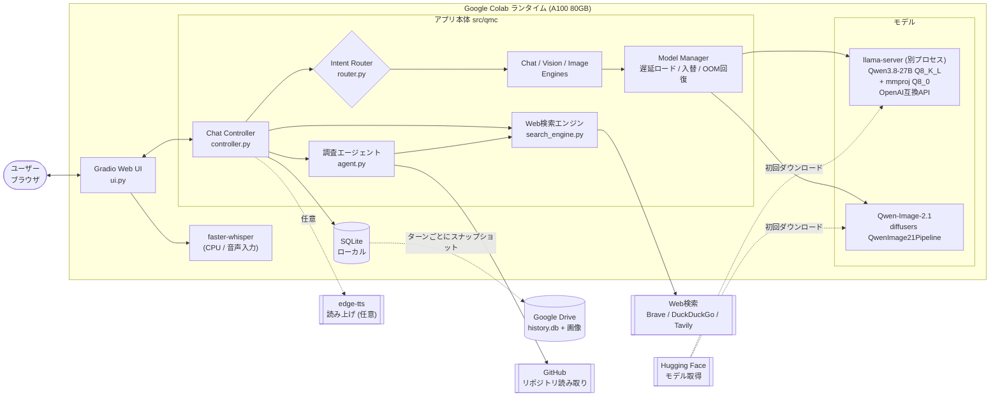
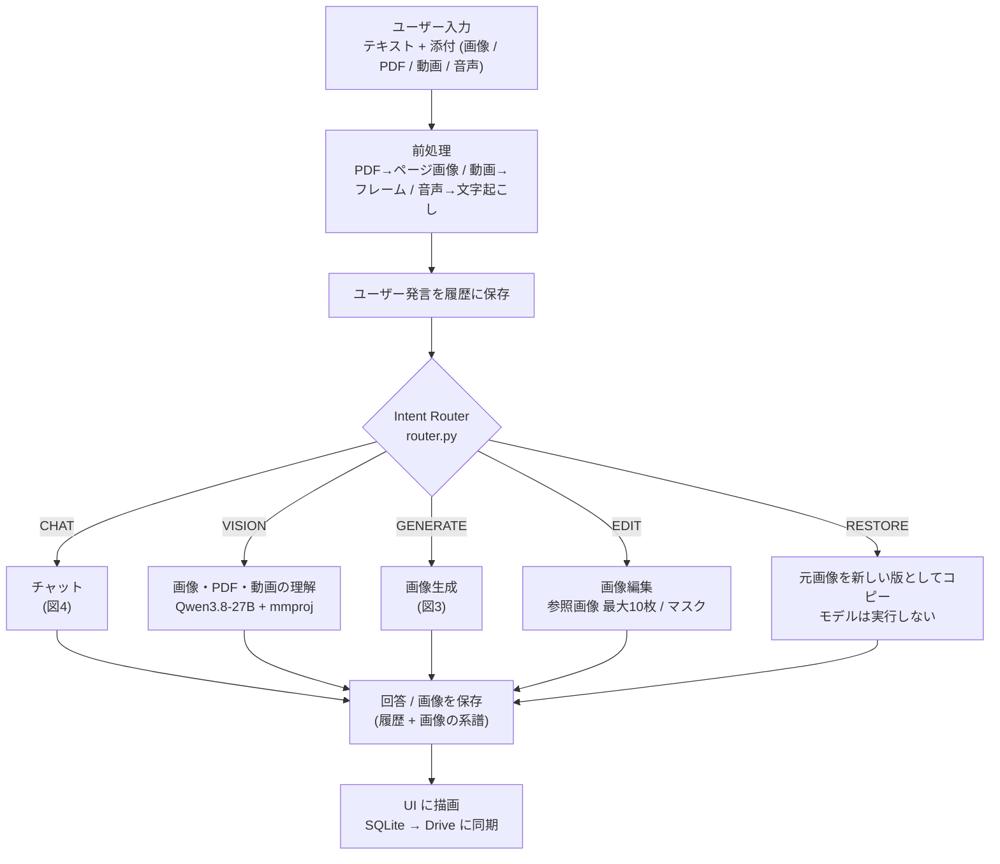
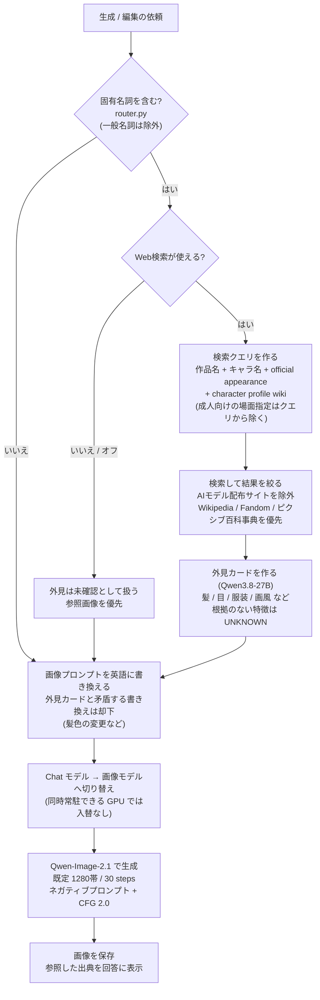
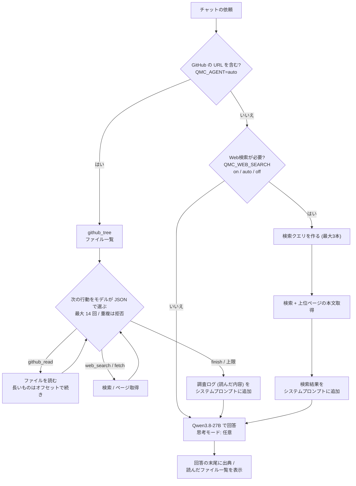
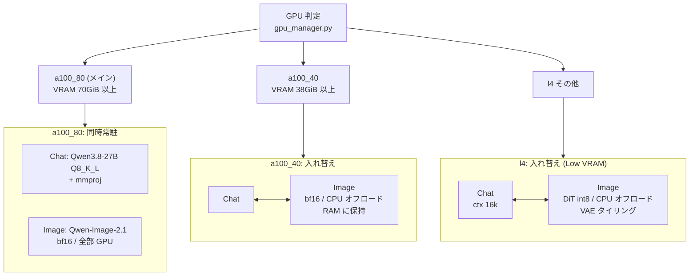
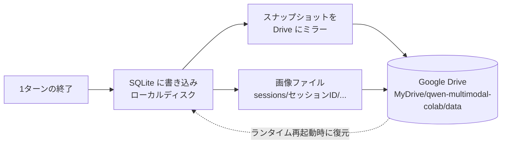
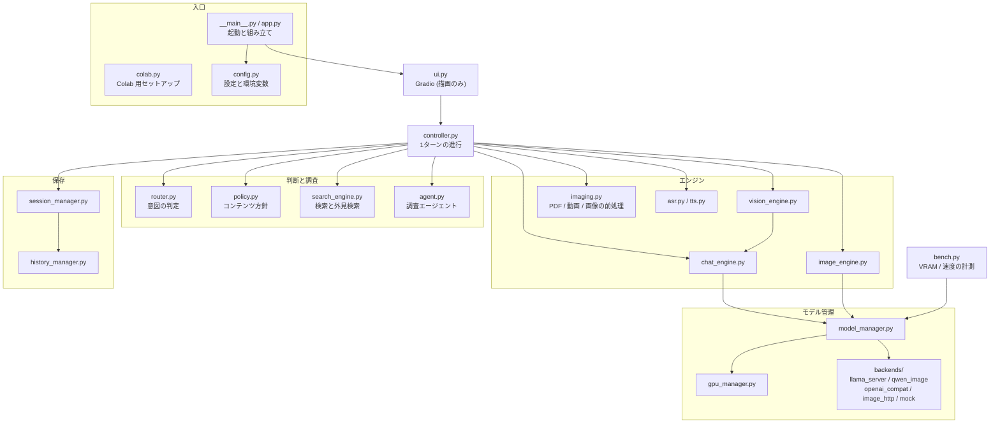

# アーキテクチャ図

現在の構成（**A100 80GB + Qwen3.8-27B Q8_K_L + Qwen-Image-2.1**）を図にまとめています。図は GitHub 上で Mermaid として表示されます。VRAM の数値は載せていません（Q8_K_L は未計測。[`vram-measurements.md`](vram-measurements.md) 参照）。

- [1. システム全体](#1-システム全体)
- [2. 1ターンの処理の流れ](#2-1ターンの処理の流れ)
- [3. 画像生成の流れ（固有キャラの外見検索つき）](#3-画像生成の流れ固有キャラの外見検索つき)
- [4. チャットの流れ（検索・調査エージェント）](#4-チャットの流れ検索調査エージェント)
- [5. モデルと GPU の配置](#5-モデルと-gpu-の配置)
- [6. データの保存](#6-データの保存)
- [7. モジュール構成](#7-モジュール構成)

## 1. システム全体

Colab の1つの GPU ランタイムの中で、Gradio 画面・アプリ本体・2つのモデルが動きます。Chat / Vision は別プロセスの `llama-server`、画像は同じ Python プロセスの diffusers です。

外部の Chat / 画像サーバーを使うこともできます（`QMC_CHAT_BASE_URL` / `QMC_IMAGE_BASE_URL`）。その場合 `MM` の先は `llama-server` / diffusers ではなく、OpenAI 互換 API と [Image HTTP API](image-http-api.md) になります。

## 2. 1ターンの処理の流れ

ユーザーの発言は必ず Router を通ります。Router はルールベースで、判定の理由は画面に表示されます。手動モードで上書きもできます。

## 3. 画像生成の流れ（固有キャラの外見検索つき）

「ブリーチの松本乱菊の画像を生成して」のように固有のキャラ・人物を指定すると、画像を作る前に外見を検索して「外見カード」を作り、プロンプトに反映します。参照画像が2枚以上あるときは、明示的に頼まれない限り検索しません。

## 4. チャットの流れ（検索・調査エージェント）

メッセージに GitHub の URL があると調査エージェントが動き、なければ通常の Web 検索の判定に進みます。どちらも検索結果・読んだファイルは「データ」として扱い、その中の指示には従いません。

## 5. モデルと GPU の配置

起動時に GPU を判定してプロファイルを選びます。**メインの対象は A100 80GB** で、Chat と画像を同時に GPU に置く設計です。A100 40GB と L4 は、必要なときだけモデルを入れ替える方式のまま残しています。

| | A100 80GB (`a100_80`) | A100 40GB (`a100_40`) | L4 (`l4`) |
| --- | --- | --- | --- |
| Chat と Image の同時常駐 | する | しない（入替） | しない（入替） |
| Chat の文脈長 | 32k | 32k | 16k |
| Image の精度 / 配置 | bf16 / 全部 GPU | bf16 / CPU オフロード | int8 / CPU オフロード |

> Chat を Q8_K_L に変更したあとの VRAM 使用量は **未計測** です。A100 80GB で `python -m qmc.bench` を再実行して確認します。Q8_K_L で動作が確認できているのは A100 80GB を想定した構成だけで、A100 40GB / L4 は未確認です。

`Model Manager` はモデルの中身を知らず、`load / unload / degrade` だけを扱います。メモリ不足（OOM）になったときは、配置を軽い方へ段階的に落として再実行します（全部 GPU → CPU オフロード → VAE タイリング → int8）。

## 6. データの保存

保存するのは、メッセージ・生成/編集した画像・画像の系譜（どの画像から作ったか）・使ったプロンプトと検索のメタ情報です。Drive が使えないときはランタイム内にだけ保存され、終了時に消えます。詳しくは [ADR-0002](adr/0002-sqlite-local-copy-with-drive-mirror.md)。

## 7. モジュール構成

| 層 | ファイル | 役割 |
| --- | --- | --- |
| UI | `ui.py` | Gradio。ロジックは持たず、Controller のイベントを描画するだけ |
| Controller | `controller.py` | 1ターン = ルーティング → 実行 → 履歴保存。UI に依存しないイベントストリーム |
| Router | `router.py` | ルールベースの意図判定と、固有キャラの外見検索が必要かの判定 |
| 検索・調査 | `search_engine.py`, `agent.py` | Web 検索、外見検索（外見カード）、GitHub 等を読む調査エージェント |
| Engines | `chat_engine.py`, `vision_engine.py`, `image_engine.py` | 文脈の組み立て、生成パラメータ |
| Model Manager | `model_manager.py`, `gpu_manager.py` | 遅延ロード、入れ替え、OOM 回復、GPU プロファイル |
| Backends | `backends/*` | モデルの実体。ローカル / 外部 API / モックを差し替え可能 |
| 保存 | `session_manager.py`, `history_manager.py` | SQLite + Drive ミラー、画像の系譜 |

設計判断は [ADR](adr/) にあります。
